# FeatureFlagsDemo
A simple .NET Core app demonstrating the use of feature flags

## Introduction
Feature Flags or Feature Toggles represent a technique used to enable / expose or disable / hide features in a solution.
It allows us to release and test features even before they are complete and ready for production.
It is a good alternative to maintaining multiple source-code branches and also provides options for feature-based software / service packages. For example, you can use feature flags to provide services on different performance tiers like Free, Standard, and Premium.
For more information about feature flags see the [Resources](#resources) section.

## Deployment strategies
Feature Flags do not offer alternatives to deployment strategies, but can be used with your preferred strategy. Whether you choose rolling updates, ring deployments, or blue / green deployments, feature flags are symbiotic with all of the above. They also make A/B testing easier through the use of flags that can be turned on and off.

## The application

The application is a simple ASP.NET Core web app which has an initial feature which generates a random name using a public API - [UI Names](https://uinames.com/).

To test the Feature Flags solution, we will introduce another feature, to retrieve GIF files based on a user search, using the [Giphy](https://giphy.com/) API. 
We will start with an intial static flag (true / false) and we will deploy the application. To prove the benefit of Feature Flags with deployment startegies, we will use Blue / Green deployments, where Green is the stable production environment, whereas Blue is the production environment where we can see our feature in action.
To make it more interesting, we will use another flag, which is dynamically calculated. This is important, as your feature flags might be calculated based on user role membership, geographic location, or time zone.

## Azure DevOps project

To make it easier to run application builds and to deploy it to Azure, we will use a simple Azure DevOps project with this GitHub repo and build and release pipelines. We enable CI for the build pipeline, but no CD on the release pipeline, we will run the deployments manually.

### Build Pipeline (CI enabled)

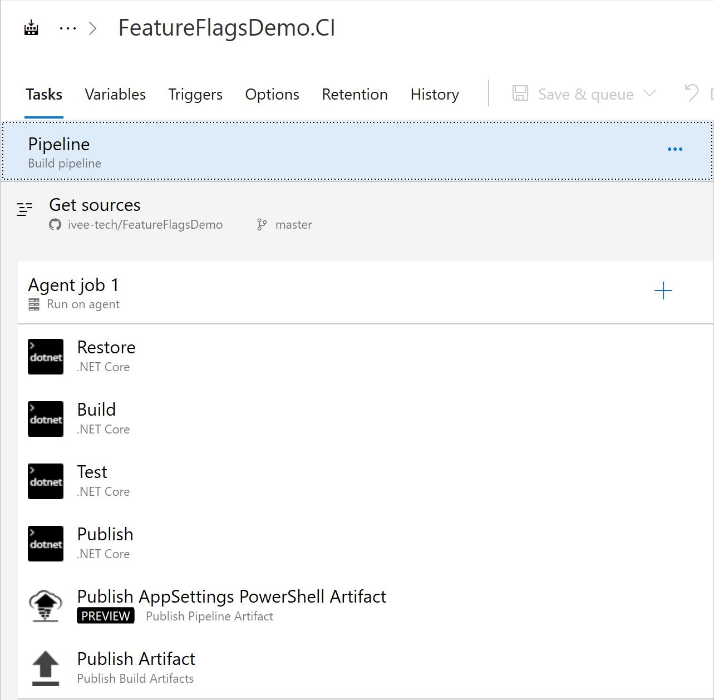

### Release Pipeline (no CD)

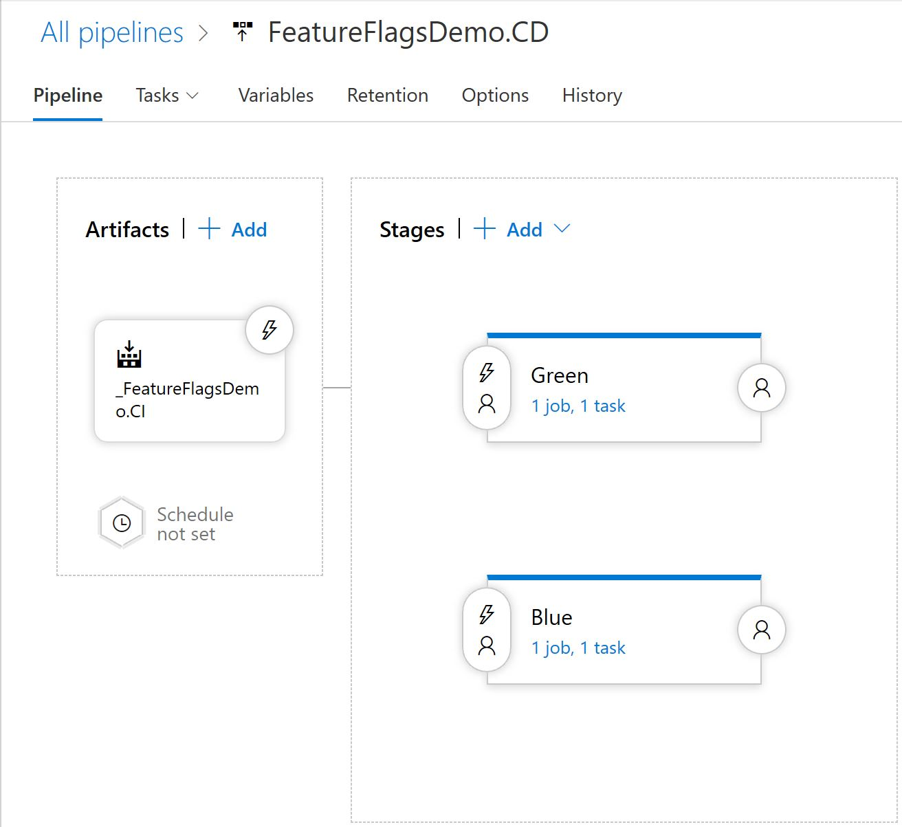

The release pipeline contains two stages, Green (the stable production environment) and Blue (the production environment containing the new Giphy feature).

## Solution structure

The solution contains the following projects:

- Microsoft.CommonLib - simple library containing the following interfaces:
    - <code>IConfigLib</code>, used for injecting configuration settings
    - <code>IFeatureFlags</code>, used for injecting feature flags handling
- Microsoft.ConfigReaders - various implementations for <code>IConfigLib</code> interface; for this project we only use <code>NetCoreSettingsConfigReader</code> for local environment (configuration settings from *appsettings.json* file) and <code>EnvVarsConfigReader</code> for production (configuration settings from process environment variables)
- TestFrontEnd - the ASP.NET Core app, with the following areas of interest:
    - *Startup.cs* file - contains the configuration and DI
    - *Interfaces* folder - contains the <code>INamesClient</code> and <code>IGiphyClient</code> interfaces used for DI our features
    - *Features* folder - contains the <code>Names</code> and <code>Giphy</code> implementations of our features, as well as the <code>FeatureFlags</code> class for handling the feature flags
    - *Controllers/HomeController.cs* - our controller containing the actions exposing the features
    - *Views/Shared/_Layout.cshtml* - the layout view where we show / hide our Giphy feature

## Green deployment

To deploy the application into the Green environment, perform the following steps:

- Execute the *scripts/deploy-template.ps1* PowerShell script. You will need to login into an Azure subscription first and you need Contributor permissions.
- Queue a build, either via a code change or manually
- Manually trigger the release and deploy into the Green stage
- Execute the *scripts/set-web-app-settings.ps1* PowerShell script to configure the <code>Features:Names:Uri</code> environment variable

If all good, if you navigate to https://ff-web-99.azurewebsites.net/Home/Name, you should see something like below:

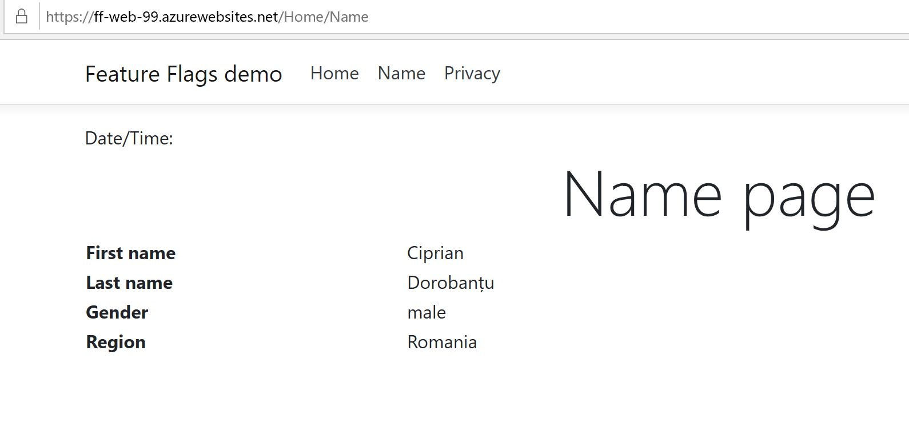

## Giphy Feature

The Giphy feature already exists in the source code, but it is commented out.
To include the related code for Giphy, perform the following steps:

- In *Startup.cs* uncomment the feature flags and giphy client dependency injection code:

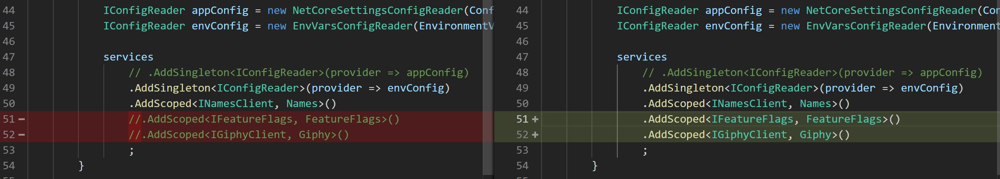

- In *Controllers/HomeController.cs* uncomment the lines related to dependency injection for feature flags and giphy, as well as the corresponding action for Giphy:

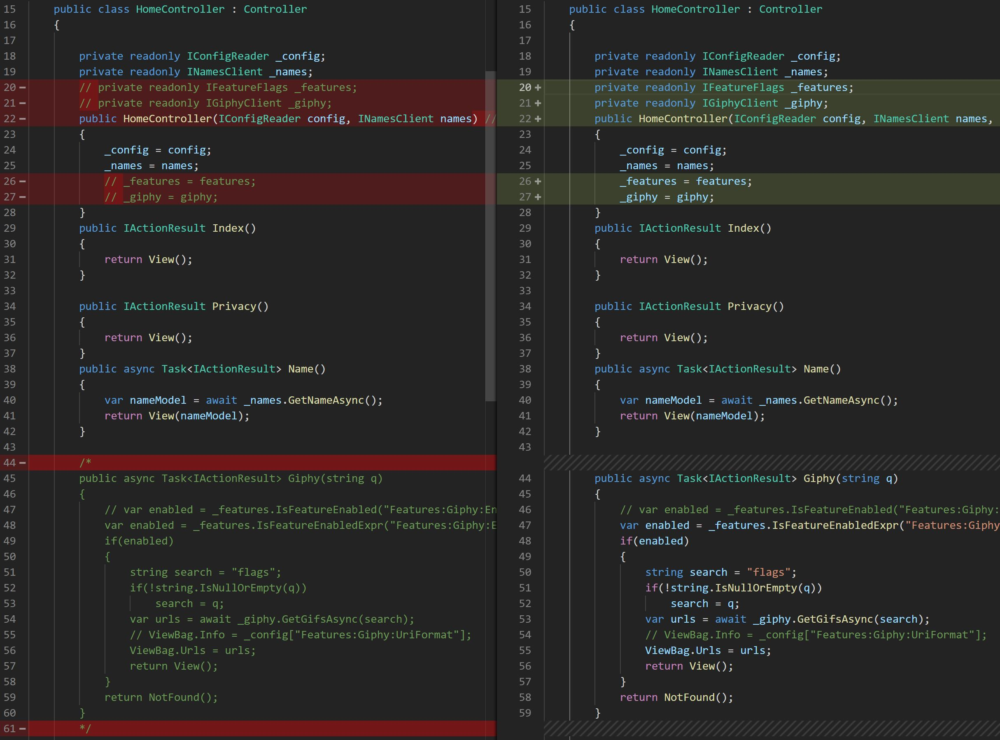

- In *Views/Shared/_Layout.cshtml* uncomment the top lines and the lines displaying the Giphy menu entry:

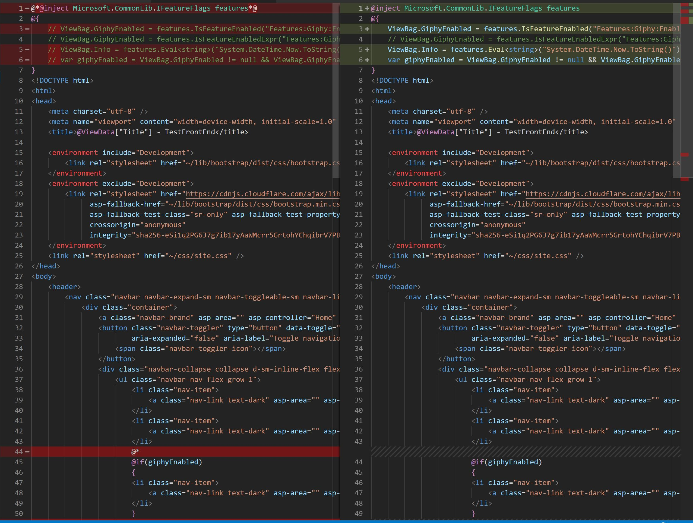

- In *scripts/deploy-template.ps1*, for deployment, uncomment the <code>$paramFilePath</code> variable setting to use the <code>azuredeploy-blue.parameters.json</code> value

- In *scripts/set-web-app-settings.ps1* uncomment the configuration settings corresponding to Giphy feature:

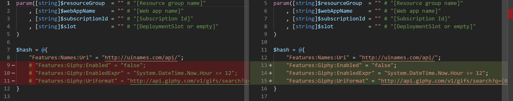


## Blue deployment

To deploy to Blue environment, perform the following steps:

- Execute the *scripts/deploy-template.ps1* PowerShell script with the Blue environment parameters file. You will need to login into an Azure subscription first and you need Contributor permissions.
- Commit and push the code changes from the section above
- The build will be triggered automatically
- If the build succeeds, manually trigger the release and deploy into the Blue enviroment
- Execute the *scripts/set-web-app-settings.ps1* PowerShell script to configure the <code>Features:Names:Uri</code>, <code>Features:Giphy:Enabled</code>, <code>Features:Giphy:EnabledExpr</code>, <code>Features:Giphy:UriFormat</code> environment variables

If all good, if you navigate to https://ff-web-99-b.azurewebsites.net/Home/Name, you should see the same as feature as in the Green environment, but no Giphy menu entry:

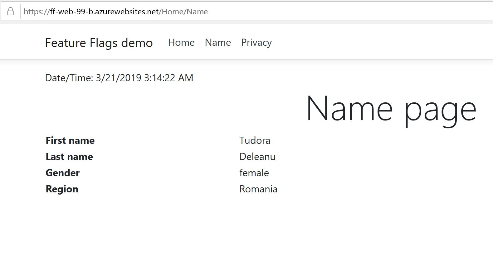

## Feature Flag - static value

If we change the <code>Features:Giphy:Enabled</code> setting from <code>false</code> to <code>true</code> as in the below image


and refresh the Blue Home page, we should see the Giphy menu entry (you may need to clear the browser cache):

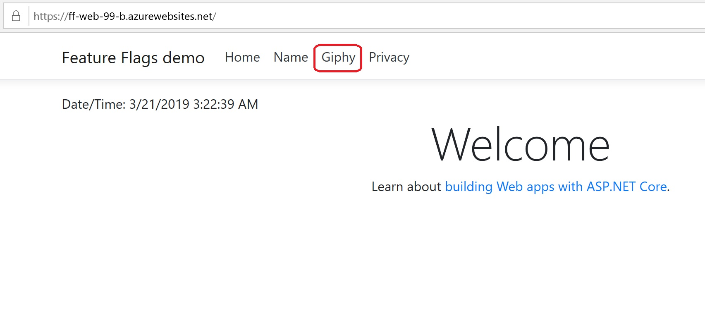

Clicking on Gihpy menu option should navigate to the Giphy page:

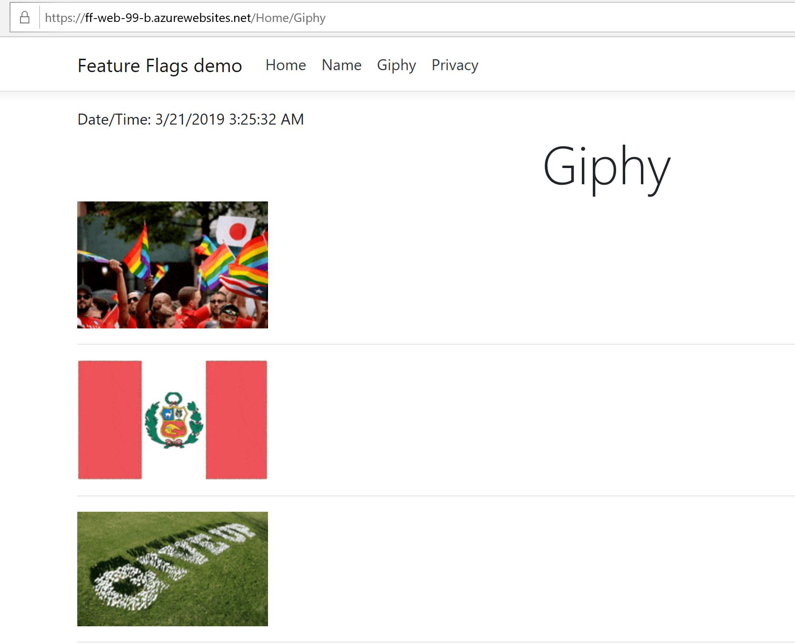

It should be noted that hiding the Giphy feature is not enough, as the user can navigate directly to the Gihpy Url. To prevent this from happening, we need to disable the feature at the controller level, by simply returning 404 (not found) in the <code>HomeController.Giphy</code> action:

``` C#
        public async Task<IActionResult> Giphy(string q)
        {
            var enabled = _features.IsFeatureEnabled("Features:Giphy:Enabled");
            // var enabled = _features.IsFeatureEnabledExpr("Features:Giphy:EnabledExpr");
            if(enabled)
            {
                string search = "flags";
                if(!string.IsNullOrEmpty(q))
                    search = q;
                var urls = await _giphy.GetGifsAsync(search);
                ViewBag.Urls = urls;
                return View();
            }
            return NotFound();
        }
```

## Feature Flag - dynamic value

Often the feature we want to enable / disable might depend on user role membership, geographic location, time of the year (Christmas sales for example), etc. If we want to take these dependencies into account, we need to evaluate expressions that will turn on and off the corresponding features.
One way to do this is to evaluate .NET expressions at runtime, using Roslyn (<code>Microsoft.CodeAnalysis.CSharp.Scripting</code> package).
The <code>FeatureFlags</code> class contains the <code>IsFeatureEnabledExpr</code> which evaluates the expression:

``` C#
        public bool IsFeatureEnabledExpr(string key)
        {
            bool result = false;
            try
            {
                var expression = _config[key];
                result = CSharpScript.EvaluateAsync<bool>(expression).Result;
            }
            catch(Exception ex)
            {
                // log ex
                result = false;
            }
            return result;
        }
```

For our demo, we check the current server time and return true if it's before noon and false otherwise:

```
    "Features:Giphy:EnabledExpr" = "System.DateTime.Now.Hour <= 12";
```

You will need to uncomment the use of the <code>Features:Giphy:EnabledExpr</code> setting in the <code>HomeController.Giphy</code> action:

``` C#
        public async Task<IActionResult> Giphy(string q)
        {
            // var enabled = _features.IsFeatureEnabled("Features:Giphy:Enabled");
            var enabled = _features.IsFeatureEnabledExpr("Features:Giphy:EnabledExpr");
            if(enabled)
            {
                string search = "flags";
                if(!string.IsNullOrEmpty(q))
                    search = q;
                var urls = await _giphy.GetGifsAsync(search);
                ViewBag.Urls = urls;
                return View();
            }
            return NotFound();
        }
```

You also need to uncomment the use of the expression in the *_Layout.cshtml* view:

``` C#
@inject Microsoft.CommonLib.IFeatureFlags features
@{
    // ViewBag.GiphyEnabled = features.IsFeatureEnabled("Features:Giphy:Enabled");
    ViewBag.GiphyEnabled = features.IsFeatureEnabledExpr("Features:Giphy:EnabledExpr");
    ViewBag.Info = features.Eval<string>("System.DateTime.Now.ToString()");
    var giphyEnabled = ViewBag.GiphyEnabled != null && ViewBag.GiphyEnabled;
}
```

Commit and push the code changes and follow the Blue deployment steps, as above. To make sure you are using the expression, turn off the <code>Features:Giphy:Enabled</code> setting. Refresh the page and, depending on the server time, the Giphy feature should be enabled / disabled.

## Configuring Azure Front Door

The Blue / Green deployments rely on the load balancer to redirect the traffic to one environment or the other.
Load balancers provide traffic redirection options based on geographic location, performance, weight, etc.
To simulate a real Blue / Green deployment scenario, we will use the Azure Front Door Service, which is an Azure feature in preview at the time of this writing.
The front door created for this demo contains the following:
 - A front-end, https://ff99.azurefd.net which will be the Url used in production
 - A back-end pool named <code>blue-green</code>, containing two back-ends:
    - the Green app service, https://ff-web-99.azurewebsites.net
    - the Blue app service, https://ff-web-99-b.azurewebsites.net
 - A simple routing rule

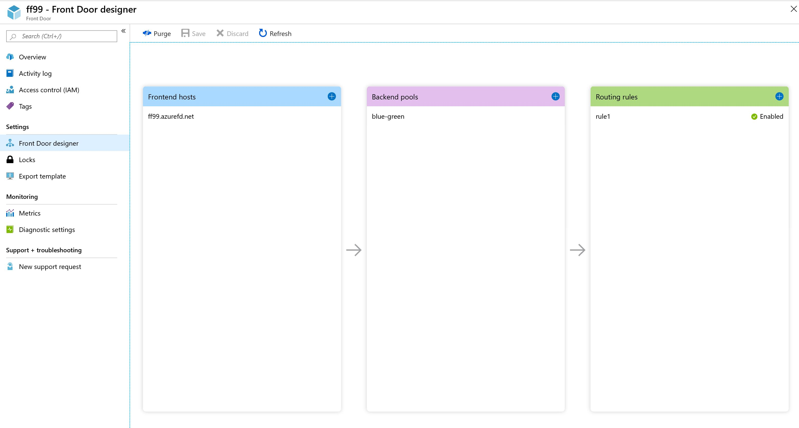

For demonstration purposes, we will use the Weight method to perform redirection. The weight has a value between 1 and 1000.
Initially we set the Green back-end weight to 1000 and the Blue weight to 1:

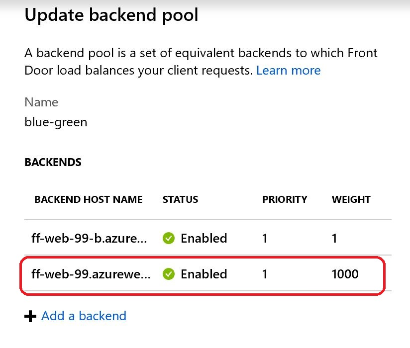

When navigating to the front door, https://ff99.azurefd.net, we are redirected to the Green environment.

We then set the Blue weight to 1000 an the Green weight to 1:

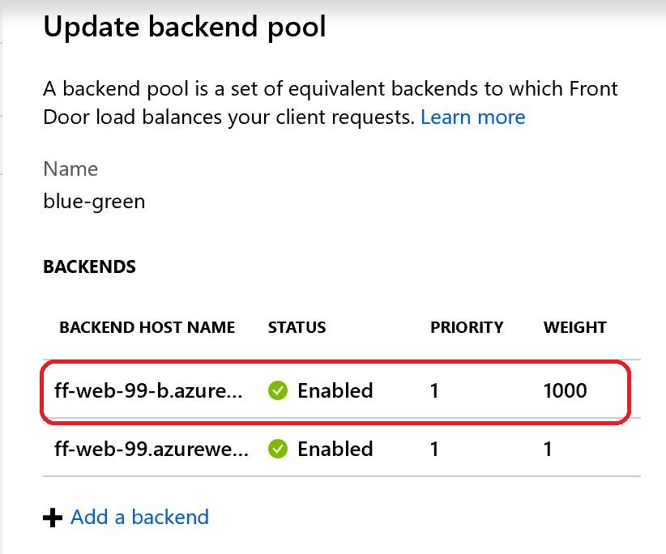

When navigating to the front door, https://ff99.azurefd.net, we are redirected to the Blue environment.

## Conclusion

Feature Flags are a powerful tool in a developer's toolbelt. However, they require discipline and proper planning to make sure they work as expected and don't impact the existing application stability.
In conjunction with deployment strategies such as Blue / Green deployments, Feature Flags could potentially help you ship many features more often and deliver value faster to your customers.

---

## Resources

 - Feature flags:
http://featureflags.io/
 - Feature toggles:
https://martinfowler.com/articles/feature-toggles.html
 - Launch Darkly:
https://launchdarkly.com/
 - Progressive experimentation:
https://docs.microsoft.com/en-us/azure/devops/articles/phase-features-with-feature-flags?view=azure-devops
 - Ring deployments:
https://opensource.com/article/18/2/feature-flags-ring-deployment-model
 - Rollout with rings:
https://docs.microsoft.com/en-us/azure/devops/articles/phase-rollout-with-rings?view=azure-devops
 - Azure Front Door service:
https://azure.microsoft.com/en-us/services/frontdoor/

